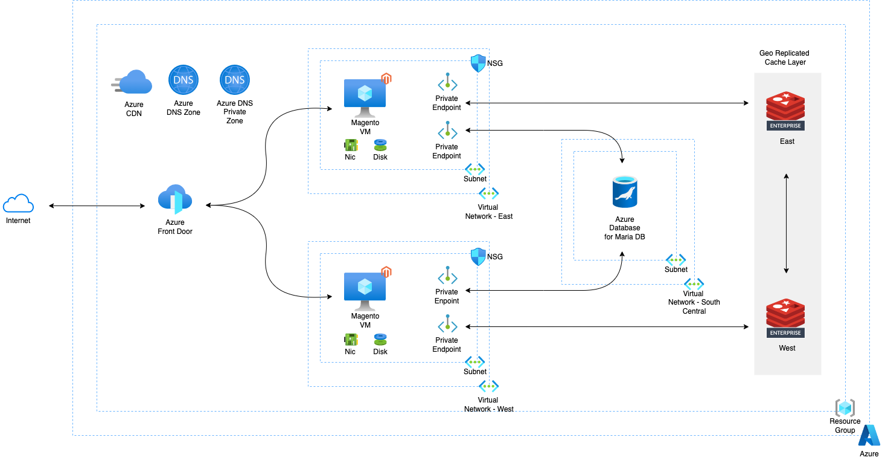
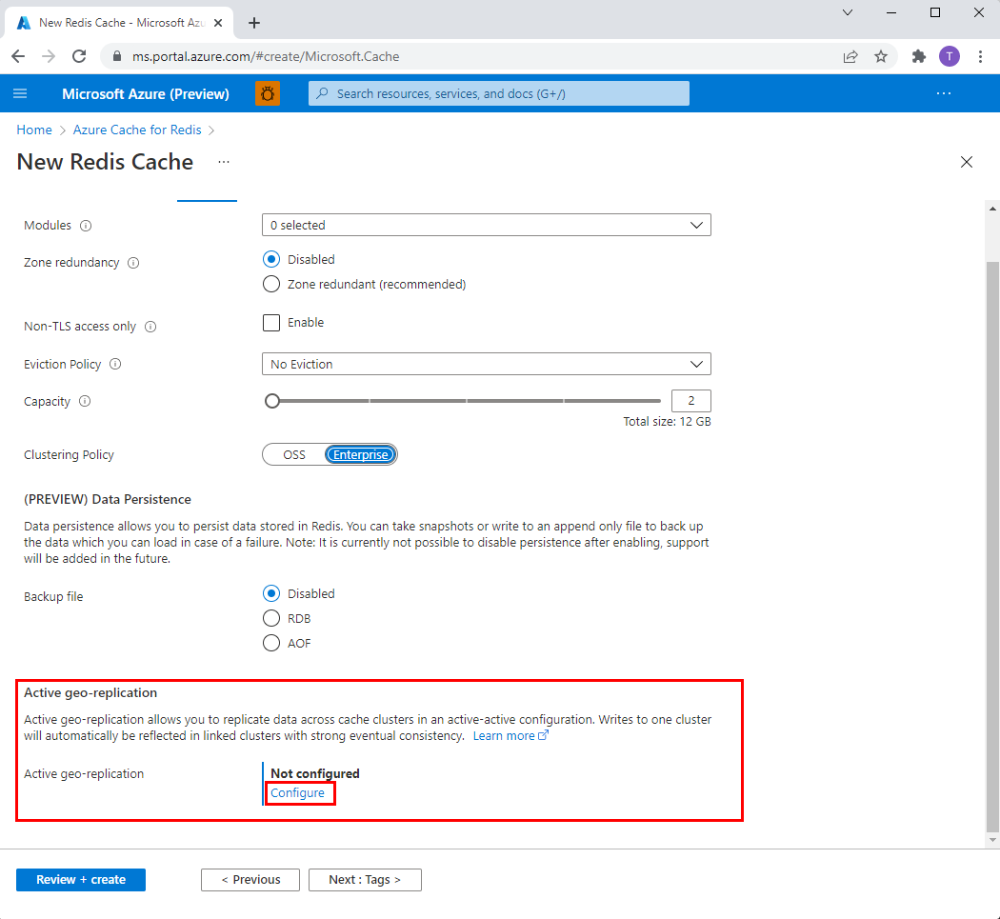
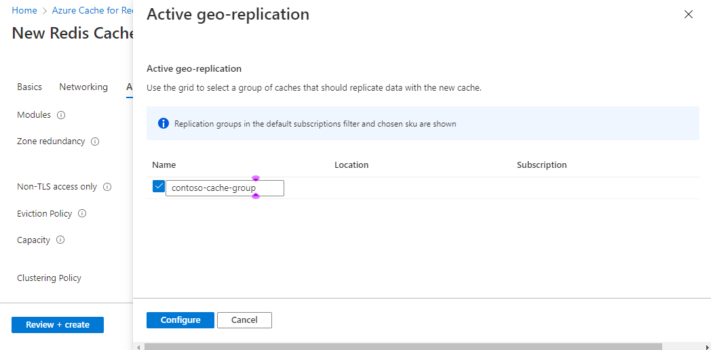
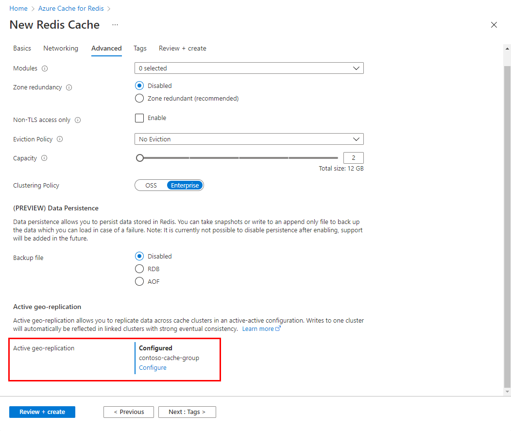
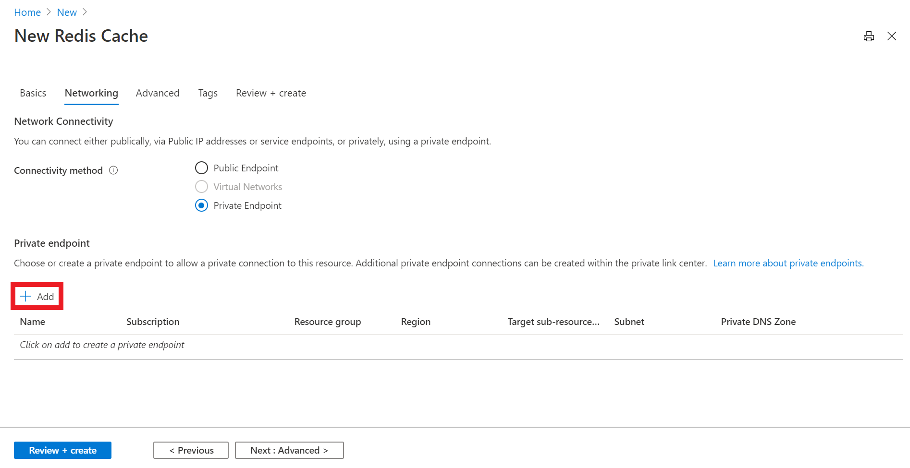

# ACRE Retail Solution

This repo contains utility code for the [ACRE Session Stability Store Solution Brief.](https://www.google.com)
<br>

They are for demonstration purposes and not meant for production.
<br><br>

  
  

## Pre-requisites

Prior to running this retail application, please ensure following pre-requisites are installed and configured.

- [Azure CLI](https://docs.microsoft.com/en-us/cli/azure/install-azure-cli) or [Azure Powershell](https://docs.microsoft.com/en-us/powershell/azure/install-az-ps?view=azps-8.1.0)
<br><br>

## High Level Workflow

The ARM Template will create all the solution stack for you. In case you want to manually build it, the following is the high level workflow which you will follow:

1. Clone this repo on to your local system
2. Set up a Azure Cache for Redis Enterprise Active Geo Replication on Microsoft Azure
3. Configure Private Links for ACRE
4. Create 2 VMs to host Magento
5. Create a 3 VNets, 1 subnet in each VNet
6. Create a Azure Database for MariaDB used by Magento
7. Create a load balancer for the retail application serving in two Azure regions
8. Access the retail application via the load balancer's endpoint
9. Tear down the environment

<br><br>

#### 1. Clone this repo

```
git clone https://github.com/Redislabs-Solution-Architects/acre-retail-solution
cd acre-retail-solution
```

#### 2. Set up a Azure Cache for Redis Enterprise Active-Active database on Microsoft Azure

Create an active-active subscription in Azure:
For this setup, you will pick **East US** and **West US** Azure regions as follows:

- When creating a new Azure Cache for Redis resource, select the **Advanced** tab. Complete the first part of the form including **Clustering policy**. !

- Select **Configure** to set up **Active geo-replication**
  
  
- Create a new replication group for a first cache instance. Or, select an existing one from the list.


- Select **Configure** to finish
  
- Wait for the first cache to be create successfully. When complete. you see **Configured** set for **Active geo-replication**. Repeat the aboe steps for each cache instance in the geo-replication group.


#### 3. Configure Private Links

- In the **Networking** tab, select **Private Endpoint** for the connectivity method.

- Select the **Add** button to create your private endpoint.


- ON the **Create a private endpoint** page, configure the settings for you private endpoint with the virtual network and subnet you created and select **OK**

#### 4. Create 2 VMs to host Magento  


#### 5. Create a 3 VNets, 1 subnet in each VNet


#### 6. Create a Azure Database for MariaDB used by Magento


#### 7. Create a load balancer for the retail application serving in two Azure regions


#### 8. Access the retail application via the load balancer's endpoint
`


#### 9. Tear down the environment

